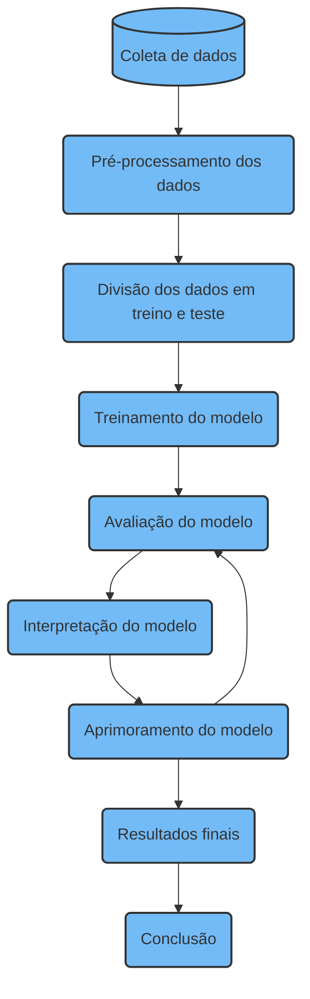

# Revista Científica UMC | RCUMC | ISSN: 2525-5150

RCUMC | Vol. 08 | N. 03 | Ano 2024

## Capa do artigo

### Título em Português:
Aplicação de métodos de aprendizado de máquina supervisionado para classificação de popularidade e gêneros de músicas brasileiras utilizando SVM.

### Título em Inglês:
Application of supervised machine learning methods to classify popularity and genres of Brazilian songs using SVM.

### Título em Espanhol:
Aplicación de métodos supervisados de aprendizaje automático para clasificar popularidad y géneros de canciones brasileñas utilizando SVM.

---

### Autores:

| Nome             | E-mail                           | ORCID                                      |
|------------------|----------------------------------|--------------------------------------------|
| Augusto Paschoal  | augusto0610@icloud.com           | https://orcid.org/0009-0000-3899-4942 |
| Bruno Melo       | brunopfc865@gmail.com            | https://orcid.org/0009-0006-2310-2431 |
| Bryan Henrique   | bryan.mestresdaweb@gmail.com      |https://orcid.org/0009-0006-4682-2028 |
| Caio Zampini     | caio.zampini@gmail.com           | https://orcid.org/0009-0000-1173-2862 |
| Carlos Henrique  | carlitossilva100@gmail.com       | https://orcid.org/0009-0009-5160-7324 |
| Davi Ferreira    | daviferreira0106@gmail.com       | https://orcid.org/0009-0009-5436-7514 |
| Lucas Lizot      | lizotllm@gmail.com               | https://orcid.org/0009-0004-7581-0574 |
| Ronald Ivan      | Roaldivan78348@gmail.com         |https://orcid.org/0009-0007-7276-9563 |
| Vitor Ferreira   | vitorantunes2003@gmail.com       |https://orcid.org/0009-0007-0485-5275 |
| Victor Matsunaga | victoryuzoumc@gmail.com          |https://orcid.org/0009-0008-4943-5837 |

---

### Instituições:
1. Universidade de Mogi das Cruzes, Mogi das Cruzes, São Paulo, Brasil.

---

### Informações:

- **Tipo de publicação**: Resumo Expandido
- **Área do Conhecimento**: Áreas Exatas e Tecnologias

RCUMC | Vol. 08 | N. 03 | Ano 2023 | Página 1 de 22

## Introdução

A música é algo que está presente em todas as esferas da sociedade e marcando vários momentos em nossas vidas, sendo ela em muitos desses momentos parte essencial no que pensamos e sentimos. Nesse caso surge a pergunta do quanto que os gostos populares e gêneros musicais possam ter influência na população e nos remeter a certas semelhanças um para com os outros, nos mostrando padrões em diferentes nichos da nossa sociedade.

Tendo em vista a relevância da música na nossa cultura, trouxemos um projeto que busca trabalhar em cima de dados reais musicais e responder a uma questão de forma inicial: Quais padrões e dados são os mais relevantes para tornarem a música popular, resumindo, o que é levado em consideração para que uma determinada música caia no gosto do popular?

Além dessa questão também iremos abordar e realizar um desafio utilizando Inteligência Artificial, onde daremos a ela todos os dados disponíveis na base de dados utilizada em questão, para que ela faça uma predição de qual o gênero musical estamos dando a ela, levando em conta os dados a ela fornecido, ou seja queremos que ela adivinhe o gênero musical de acordo com as features a ela disponibilizadas.

Para essas duas análises, faremos uso dos dados disponibilizados pelo Dataset “Spotify Tracks” onde aplicaremos técnicas, modelos e ferramentas da Inteligência Artificial.

Começando pelo modelo a ser utilizado no projeto, abordaremos o modelo SVM (Support Vector Machine) que é um dos tipos de aprendizado de máquina supervisionados, ao qual é excelente para fazer classificações, regressões e mapear dados para buscar assim um hiperplano para os dados a ele disponibilizados.

---

RCUMC | Vol. 08 | N. 03 | Ano 2023 | Página 2 de 22

## Objetivos

O projeto traz duas principais temáticas no seu desenvolvimento, o primeiro a classificação de popularidade de músicas brasileiras, já o segundo desafia a inteligência artificial a acertar o gênero musical de acordo com as features disponibilizadas a análise. Em ambos os casos, buscamos explorar o dataset "Spotify Tracks" para assim chegarmos a conclusões relevantes sobre o contexto musical, tais como: o que leva uma música a cair no gosto popular das pessoas, o que a torna tão atrativa e como a inteligência artificial pode prever o gênero da música através de outros dados.

---

RCUMC | Vol. 08 | N. 03 | Ano 2023 | Página 3 de 22

## Metodologia

### Fontes dos dados

Este trabalho faz uso de um conjunto de dados de domínio público disponibilizado pela plataforma Kaggle. O conjunto de dados contém 114,000 registros e 21 variáveis, sendo a popularidade e gênero musical as variáveis dependentes.

### Variáveis dependentes

**Popularidade**  
A variável popularidade é representada por um número inteiro que varia de 0 a 100, sendo 100 o indicativo de uma música altamente popular. A métrica de popularidade foi calculada empregando um algoritmo baseado principalmente no número de vezes que a música foi tocada, com mais peso a reproduções recentes. Concisamente, músicas mais reproduzidas recentemente têm uma popularidade maior em comparação às que foram reproduzidas em períodos anteriores.

**Gênero musical**  
O gênero de uma música refere-se a uma classe, tipo ou categoria convencional, derivada de particularidades estilísticas e caracterizada pela repetição de elementos sonoros. Este conjunto de dados contém 114 gêneros musicais distintos, e cada música é associada a exatamente um gênero.

### Ferramentas e Versões

Para a análise e manipulação dos dados, foram utilizadas ferramentas amplamente empregadas em algoritmos de aprendizado de máquina no ambiente Python: pandas, numpy, seaborn, matplotlib e scikit-learn. As versões utilizadas são as seguintes:

- python 3.12.3
- pandas 2.2.2
- numpy 1.26.4
- seaborn 0.13.2
- matplotlib 3.9.0
- scikit-learn 1.5.2

---

RCUMC | Vol. 08 | N. 03 | Ano 2023 | Página 4 de 22

### Processamento de Dados

O processamento dos dados foi realizado utilizando Python, com foco na manipulação e preparação do conjunto de dados para análise.

### Seleção de Gêneros Musicais

Neste trabalho, foram selecionados apenas os registros pertencentes aos gêneros musicais brasileiros: brazil, MPB, pagode, samba e sertanejo. Após essa filtragem, a dimensão do conjunto de dados foi reduzida para 5.000 registros e 21 variáveis.

### Eliminação de Valores Nulos

Utilizou-se a função `dropna` da biblioteca pandas para eliminar registros com valores nulos. No entanto, após as transformações iniciais, verificou-se que o conjunto de dados não continha valores ausentes, mantendo-se as mesmas dimensões.

### Exclusão de Variáveis

Variáveis consideradas insignificantes para os objetivos deste trabalho foram removidas. As variáveis `Unnamed: 0` e `track_id` foram excluídas após análise, por não contribuírem para a classificação de popularidade e gênero.

### Codificação

**Label Encoding**  
Foi utilizada a técnica de codificação Label Encoding, que converte categorias em valores numéricos inteiros entre 0 e o número de categorias únicas menos 1. O `LabelEncoder` da biblioteca scikit-learn foi aplicado nas variáveis artistas, nome do álbum, nome da música e gênero musical.

---

RCUMC | Vol. 08 | N. 03 | Ano 2023 | Página 5 de 22

### Manipulação e Preparação para Treino

#### Separação dos Dados para Treinamento e Teste

Para treinar o modelo de aprendizado de máquina, foi utilizada a função `train_test_split`, que divide os dados em conjuntos de treino e teste. A divisão foi realizada de modo que 80% dos dados fossem destinados ao treinamento e 20% para o teste com a seed geradora de números pseudo-aleatórios igual a 42. A variável popularidade foi utilizada como a variável dependente.

#### Normalização dos Dados

A normalização das variáveis foi realizada utilizando o `StandardScaler` da biblioteca scikit-learn. O `StandardScaler` subtrai a média de cada variável e divide pelo seu desvio padrão, garantindo que o desvio padrão de cada variável seja igual a 1.

---

RCUMC | Vol. 08 | N. 03 | Ano 2023 | Página 6 de 22

### Treino Inicial

#### Support Vector Classifier (SVC)

O Support Vector Classifier (SVC) é um modelo de aprendizado de máquina que busca encontrar o hiperplano que melhor separa as classes. Esse modelo foi utilizado no treinamento inicial, com os dados de treino conforme descrito anteriormente. O modelo utilizado foi implementado com a biblioteca scikit-learn.

#### Matriz de Confusão

A matriz de confusão foi gerada utilizando as bibliotecas seaborn e matplotlib para visualizar a comparação entre os valores reais e os previstos pelo modelo, conforme ilustrado na figura 1.

---

RCUMC | Vol. 08 | N. 03 | Ano 2023 | Página 7 de 22

_Sat%20Oct%2019%2012-22-16%202024.png)

#### Acurácia

A acurácia do modelo inicial foi considerada baixa, com uma taxa de acerto de apenas 14%.

---

RCUMC | Vol. 08 | N. 03 | Ano 2023 | Página 8 de 22

### Ajustes de Hiperparâmetros

#### Grid Search

Grid Search é uma técnica utilizada para otimizar a escolha dos hiperparâmetros de um modelo. A técnica explora uma grade de diferentes combinações de hiperparâmetros para identificar o melhor estimador dentre todas as permutações. A grade de hiperparâmetros utilizada neste trabalho foi:

- C: 0,1 | 1 | 10 | 100
- Gamma: 1 | 0,1 | 0,01 | 0,001
- Kernel: Linear | RBF | Poly

O método `GridSearch` da biblioteca scikit-learn foi empregado para realizar a busca, em conjunto com o modelo SVC descrito anteriormente.

---

RCUMC | Vol. 08 | N. 03 | Ano 2023 | Página 9 de 22

#### Melhores Hiperparâmetros

Os melhores hiperparâmetros encontrados foram:

- C: 10
- Gamma: 0,1
- Kernel: RBF

#### Treinamento Utilizando Melhores Hiperparâmetros

##### Acurácia

A acurácia do modelo SVC, ao ser ajustada com os melhores hiperparâmetros, apresentou um aumento significativo, passando de 14% para 25%.

##### Matriz de Confusão

A Figura 2 apresenta a matriz de confusão, que compara os valores reais e os previstos pelo modelo descrito anteriormente.

_Sat%20Oct%2019%2012-58-03%202024.png)

---

RCUMC | Vol. 08 | N. 03 | Ano 2023 | Página 10 de 22

### Análise de Variáveis

#### Importância das Variáveis

A Figura 3 demonstra a importância de cada variável no modelo.

_Sat%20Oct%2019%2012-58-07%202024.png)

---

RCUMC | Vol. 08 | N. 03 | Ano 2023 | Página 11 de 22

### Classificação de Gênero Musical

#### Processamento Prévio

Foi utilizada a mesma sequência de procedimentos descrita até a Seção anterior. Contudo, nesta fase, o gênero musical foi empregado como a variável dependente a ser classificada.

#### Matriz de confusão

A matriz de confusão foi gerada utilizando as bibliotecas seaborn e matplotlib para visualizar a comparação entre os valores reais e os previstos pelo modelo, conforme ilustrado na Figura 4.

#### Acurácia

A acurácia do modelo inicial foi considerada alta, com uma taxa de acerto de 61%.

#### Grid Search

Foi utilizada a mesma grade de hiperparâmetros descrita na seção anterior. Os melhores hiperparâmetros encontrados foram:

- C: 10
- Gamma: 0,01
- Kernel: RBF

---

RCUMC | Vol. 08 | N. 03 | Ano 2023 | Página 12 de 22

#### Treinamento Utilizando Melhores Hiperparâmetros

##### Acurácia

A acurácia do modelo SVC, após o ajuste com os melhores hiperparâmetros, não apresentou diferenças significativas, permanecendo em 61%.

##### Matriz de Confusão

A Figura 5 apresenta a matriz de confusão, que compara os valores reais e os previstos pelo modelo descrito anteriormente.

---

RCUMC | Vol. 08 | N. 03 | Ano 2023 | Página 13 de 22

#### Análise de Variáveis

A Figura 6 demonstra a importância de cada variável no modelo.

---

RCUMC | Vol. 08 | N. 03 | Ano 2023 | Página 14 de 22

### Comparação

A seguir, são apresentados os valores médios das variáveis quando classificadas como falso positivo e falso negativo:

| Variável          | Falso Positivo | Falso Negativo |
|-------------------|----------------|----------------|
| artists           | 810.328358     | 778.896552     |
| album_name        | 1308.589552    | 1178.931034    |
| track_name        | 1885.582090    | 1890.827586    |
| popularity        | 39.902985      | 43.758621      |
| duration_ms       | 230781.910448  | 234262.919540  |
| explicit          | 0.000000       | 0.034483       |
| danceability      | 0.564522       | 0.582126       |
| energy            | 0.580090       | 0.623414       |
| key               | 5.559701       | 5.747126       |
| loudness          | -9.425433      | -8.246264      |
| mode              | 0.746269       | 0.643678       |
| speechiness       | 0.051847       | 0.065368       |
| acousticness      | 0.367495       | 0.416328       |
| instrumentalness  | 0.002564       | 0.028118       |
| liveness          | 0.305936       | 0.414851       |
| valence           | 0.537567       | 0.598631       |
| tempo             | 116.537881     | 124.860598     |
| time_signature    | 3.910448       | 3.988506       |

---

RCUMC | Vol. 08 | N. 03 | Ano 2023 | Página 15 de 22

### Palavras Chave

Música, artista, álbum, Machine Learning, gêneros, popularidade, Support Vector Machine, Análise de dados de usuários, playlists, musicais, áudio, som, spotify, recomendação, curadoria, padrões, predição, filtragem, personalização, otimização, identificação, análise, sugestões, escuta, preferências, algoritmo, dados, perfis, sistemas, classificação e inteligência artificial.

---

RCUMC | Vol. 08 | N. 03 | Ano 2023 | Página 16 de 22

### Quadros e Gráficos

#### Matriz de Confusão com parâmetros padrão - Gênero

---

RCUMC | Vol. 08 | N. 03 | Ano 2023 | Página 17 de 22

#### Matriz de Confusão com melhores parâmetros

---

RCUMC | Vol. 08 | N. 03 | Ano 2023 | Página 18 de 22

#### Permutação exibindo as melhores features para classificação de gênero

---

RCUMC | Vol. 08 | N. 03 | Ano 2023 | Página 19 de 22

#### Plotagem dos gráficos e resultados visuais obtidos após a análise e teste realizado com o dataset, buscando o melhor hiperplano que explique qual a semelhança e correlação de dados que tornem algumas músicas mais populares que outras.

---

RCUMC | Vol. 08 | N. 03 | Ano 2023 | Página 20 de 22

#### Matriz de confusão sem os melhores parâmetros - Popularidade

---

RCUMC | Vol. 08 | N. 03 | Ano 2023 | Página 21 de 22

#### Matriz de confusão com os melhores parâmetros – Popularidade

---

RCUMC | Vol. 08 | N. 03 | Ano 2023 | Página 22 de 22

#### As features mais relevantes na análise realizada para a montagem de escala da popularidade da música

---

### Plotagem do fluxo de trabalho baseado na metodologia do sistema

- Introdução
- Objetivos
- Metodologia
- Fontes dos dados
- Variáveis dependentes
- Ferramentas e Versões
- Processamento de Dados
- Seleção de Gêneros Musicais
- Eliminação de Valores Nulos
- Exclusão de Variáveis
- Codificação
- Label Encoding
- Manipulação e Preparação para Treino
- Separação dos Dados para Treinamento e Teste
- Normalização dos Dados
- Treino Inicial
- Support Vector Classifier (SVC)
- Matriz de Confusão
- Acurácia
- Ajustes de Hiperparâmetros
- Grid Search
- Melhores Hiperparâmetros
- Treinamento Utilizando Melhores Hiperparâmetros
- Acurácia
- Matriz de Confusão
- Análise de Variáveis
- Importância das Variáveis
- Classificação Corretamente
- Classificação de Gênero Musical
- Processamento Prévio
- Matriz de confusão
- Acurácia
- Grid Search
- Treinamento Utilizando Melhores Hiperparâmetros
- Acurácia
- Matriz de Confusão
- Importância das Variáveis
- Comparação
- Classificação Corretamente

---

